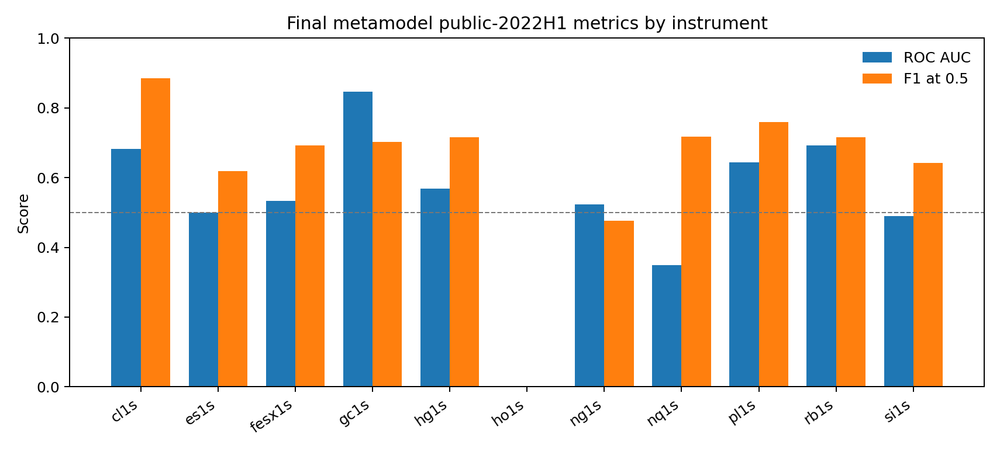
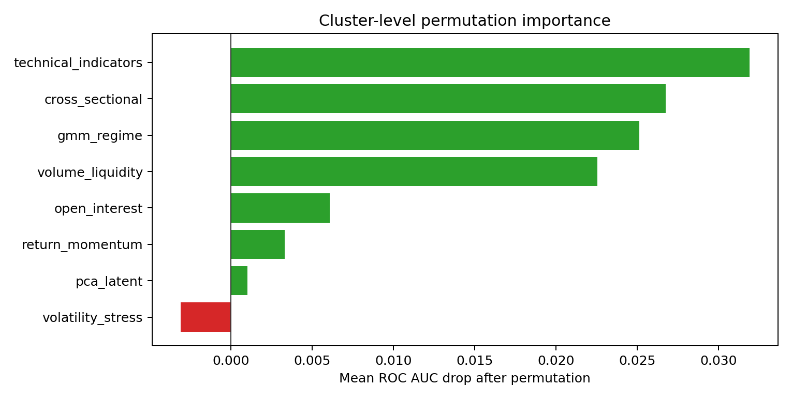
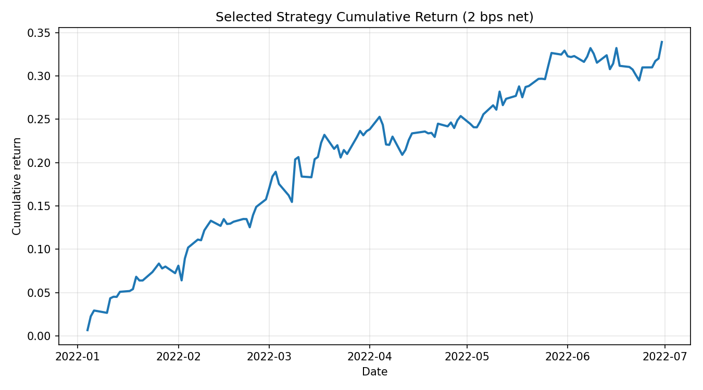
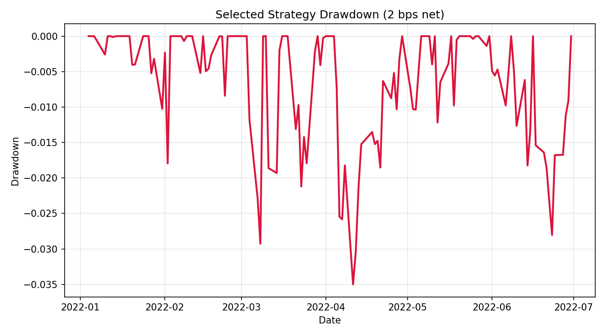

# Executive Summary

This report documents a metamodel built on top of the supplied BUSI70575 primary trading signals. The official coursework asks for a probability that each primary signal is worth following under a triple-barrier exit rule, with feature engineering, triple-barrier labeling, model comparison, cluster-level feature importance, clean out-of-sample evaluation, and optional strategy construction.

The implementation covers the full 11-instrument universe across equity index futures, energy, and metals. The final required file is `metamodel_predictions.csv` for public 2022H1. It contains 1408 rows, 128 trading dates, 11 instruments, and the exact columns `date,instrument,prediction`. The prediction date range is 2022-01-03 to 2022-06-30.

The promoted final model is a sigmoid-calibrated 50/50 blend of a Logistic Regression metamodel and a signal-history MLP. Its public-2022H1 aggregate ROC AUC is 0.583 and aggregate F1 is 0.626. The final prediction SHA256 is `c5c7ca869d905b384ef3c9072c3377e0f43c7a7ad03c9125aa062077f0f9b369`.

Source requirement checked: [https://hm-ai.github.io/BUSI70575/coursework/](https://hm-ai.github.io/BUSI70575/coursework/), accessed 2026-05-27.

# Official Requirement Mapping

| Requirement | Delivered artifact |
| --- | --- |
| Code | Python package in Deliverables/code with CLI runner and notebooks. |
| Required predictions | Deliverables/required/metamodel_predictions.csv. |
| Prediction format | date, instrument, prediction; probabilities clipped to [0, 1]. |
| Optional weights | Deliverables/optional_strategy/strategy_weights.csv. |
| Research evidence | Supporting CSVs, audits, threshold analysis, and cluster importance. |

# Data and Universe

The input data are the official `ohlcv_data.csv` and `primary_signals.csv` files. OHLCV data provide open, high, low, close, volume, and open interest. Primary signals start in January 2020 and are encoded as `+1` for long, `-1` for short, and `0` for no trade. This project models all 11 instruments rather than only one asset class.

# Methodology

## Feature Engineering

All predictors are lagged before modeling so that the metamodel does not use same-day or future OHLCV information. Zero primary signals are not treated as trade opportunities for training; in the final deliverable they receive neutral probability 0.5.

| Feature cluster | Purpose |
| --- | --- |
| Return and momentum | Lagged returns, moving-average gaps, price z-scores. |
| Volatility and range | Realized volatility, ATR, downside volatility, volatility percentiles. |
| Technical indicators | RSI, MACD, Bollinger position, stochastic oscillator. |
| Volume and liquidity | Volume changes, open-interest features, Amihud proxy. |
| Cross-sectional context | Daily ranks and asset-class momentum/volatility. |
| Latent regimes | GMM regimes and PCA latent OHLCV components; HMM tested but disabled. |
| Signal history | Rolling hit rates, signal counts, win rates, success/failure streaks. |

## Triple-Barrier Labeling

The target is a binary meta-label for a non-zero primary-signal trade opportunity. A label is positive when following the signal reaches the profit-taking barrier before the stop-loss barrier within the vertical barrier; otherwise it is negative. The frozen final run uses a 10 trading-day vertical barrier, 1.5x profit-taking, 1.5x stop-loss, and a 60-day lagged volatility estimate. A wider label-search appendix tested 144 specifications; it was used for robustness discussion but was not promoted.

## Model Development

The model suite covers the required families: regularized Logistic Regression, Random Forest, Extra Trees, HistGradientBoosting, AdaBoost, and MLP. Hyperparameters are selected on chronological validation data before the public 2022H1 test window. The final promoted prediction file comes from the calibrated Logistic plus signal-history MLP blend because it improved AUC while preserving interpretability and passing guardrails.

| Experiment | Family | Instruments | Mean AUC | Mean F1 |
| --- | --- | --- | --- | --- |
| + signal_history | mlp | 11 | 0.579 | 0.612 |
| baseline | logistic | 11 | 0.573 | 0.614 |
| + signal_history | logistic | 11 | 0.572 | 0.553 |
| + signal_history | adaboost | 11 | 0.562 | 0.624 |
| + regime_interactions | adaboost | 11 | 0.560 | 0.628 |
| + vol_stress | adaboost | 11 | 0.558 | 0.622 |
| + trend_scanning | mlp | 11 | 0.557 | 0.608 |
| + regime_interactions | logistic | 11 | 0.556 | 0.546 |

## Challenger Guardrails

The final blend was promoted only after guardrails comparing it to the stable logistic reference: mean AUC improvement, limited F1 deterioration, no material deterioration in weak instruments, and sufficient explainability.

| Challenger | Mean AUC | Mean F1 | AUC Delta | Pass |
| --- | --- | --- | --- | --- |
| blend_0.50_logistic_0.50_mlp | 0.583 | 0.614 | 0.012 | True |
| blend_0.50_logistic_0.50_mlp_sigmoid_calibrated | 0.583 | 0.626 | 0.012 | True |
| blend_0.60_logistic_0.40_mlp_sigmoid_calibrated | 0.582 | 0.621 | 0.011 | True |
| blend_0.60_logistic_0.40_mlp | 0.582 | 0.608 | 0.011 | False |
| blend_0.70_logistic_0.30_mlp | 0.582 | 0.607 | 0.010 | False |
| blend_0.75_logistic_0.25_mlp | 0.580 | 0.607 | 0.008 | False |

# Out-of-Sample Evaluation

The public out-of-sample period is January to June 2022. The hidden July to December 2022 period is not used. The table below reports per-instrument AUC and fixed 0.5-threshold classification metrics for the final frozen prediction file.

| Instrument | Test events | AUC | Precision | Recall | F1 |
| --- | --- | --- | --- | --- | --- |
| cl1s | 83 | 0.682 | 0.795 | 1.000 | 0.886 |
| es1s | 115 | 0.501 | 0.447 | 1.000 | 0.618 |
| fesx1s | 123 | 0.534 | 0.560 | 0.910 | 0.693 |
| gc1s | 24 | 0.846 | 0.542 | 1.000 | 0.703 |
| hg1s | 118 | 0.569 | 0.578 | 0.940 | 0.716 |
| ho1s | 2 |  | 0.000 | 0.000 | 0.000 |
| ng1s | 56 | 0.524 | 0.349 | 0.750 | 0.476 |
| nq1s | 118 | 0.348 | 0.559 | 1.000 | 0.717 |
| pl1s | 99 | 0.644 | 0.626 | 0.966 | 0.760 |
| rb1s | 123 | 0.693 | 0.779 | 0.662 | 0.716 |
| si1s | 114 | 0.490 | 0.473 | 1.000 | 0.642 |

| Asset class | Instruments | Reference mean AUC | Reference mean F1 | Blind baseline F1 |
| --- | --- | --- | --- | --- |
| energy | 4 | 0.631 | 0.515 | 0.550 |
| equity_index | 3 | 0.464 | 0.632 | 0.679 |
| metals | 4 | 0.610 | 0.699 | 0.702 |



# Cluster-Level Feature Importance

Cluster-level permutation importance is used because financial features are highly correlated. The table reports the average drop in ROC AUC and F1 after permuting each feature cluster.

| Cluster | Mean AUC drop | Mean F1 drop | Avg. features |
| --- | --- | --- | --- |
| technical_indicators | 0.032 | 0.012 | 24.000 |
| cross_sectional | 0.027 | 0.017 | 7.000 |
| gmm_regime | 0.025 | 0.003 | 5.000 |
| volume_liquidity | 0.023 | 0.008 | 5.000 |
| open_interest | 0.006 | 0.006 | 4.000 |
| return_momentum | 0.003 | 0.007 | 14.000 |
| pca_latent | 0.001 | 0.004 | 3.000 |
| volatility_stress | -0.003 | 0.010 | 6.000 |



# Optional Strategy Construction

The optional strategy track converts the final metamodel probabilities into signed weights using the primary signal direction. The selected simple rule is `soft_allocation`, where raw weight is primary signal times metamodel probability, followed by daily gross-exposure normalization and a maximum absolute instrument weight cap of 0.25.

| Cost bps | Cum. return | CAGR | Ann. vol | Sharpe | Max drawdown | Avg turnover |
| --- | --- | --- | --- | --- | --- | --- |
| 0 | 0.358 | 0.834 | 0.141 | 4.388 | -0.035 | 0.543 |
| 1 | 0.348 | 0.810 | 0.141 | 4.288 | -0.035 | 0.543 |
| 2 | 0.339 | 0.785 | 0.141 | 4.189 | -0.035 | 0.543 |
| 5 | 0.312 | 0.713 | 0.141 | 3.891 | -0.036 | 0.543 |

The public-window backtest is a sanity check, not evidence of a production trading system. The selected strategy matches the blindly-follow-primary-signal equal-weight baseline under the current conservative cap and normalization, so the bonus result should be presented cautiously.





# Reproducibility and Code Quality

The cleaned deliverable is organized as a notebook-first workflow plus a `coursework/src` package. The notebook is the readable execution layer; `coursework/src` contains the reusable implementation. The pipeline order is data loading, panel validation, lagged feature construction, triple-barrier labeling, model-suite comparison, final model reproduction, out-of-sample evaluation, cluster importance, prediction export, and audit writing.

In the packaged deliverable, open and run all cells:

`Deliverables/code/coursework/notebooks/00_final_reproducible_pipeline.ipynb`

For a genuinely new prediction period, use the final section of the notebook. It calls `coursework.src.prediction.predict_new_period`, which retrains the promoted Logistic + signal-history MLP blend recipe on data strictly before the requested window:

```python
new_result = predict_new_period(new_config, output_path="outputs/new_period_predictions.csv")
```

# Limitations

The public test sample is short, and some instruments have few completed triple-barrier events in 2022H1. Small metric differences should not be overinterpreted. The triple-barrier settings are justified and tested, but they are still modeling assumptions. HMM features were implemented experimentally but disabled in the final submission because they did not pass the promotion guardrails.
